# Pràctica 3

## Bases de dades d’objectes relacionals

1. Quins són els conceptes principals de les BDOR?
    - Les classes, els tipus i els rols.
2. Quina és la idea bàsica de les BDOR?
    - Aplicar l'estructura de programació orientada a objectes a les bases de dades.
## Model orientat a objectes
#### L’objectiu d’aquesta activitat és conèixer les característiques bàsiques dels models orientats a objectes.
Indiqueu quines diferències hi ha entre:
1. Encapsulació i herència
    - L’encapsulació es refereix a l'agrupació de les dades amb els mètodes que operen sobre aquestes dades. L’encapsulació s’utilitza per amagar els valors o l’estat d'una estructura de dades dins d'un objecte, prevenint d’aquesta manera accessos a la seva informació per part de tercers. Les classes solen tenir mètodes públics que tracten la seva informació interna, de manera que tercers (altres objectes) poden interactuar d’una forma segura amb la informació interna d’aquestes. 
    - L'herència és la reutilització de mètodes i atributs, per part d'una classe que parteix d'una classe jerarquicament superior.
2. Polimorfisme i sobrecàrrega

    - La sobrecàrrega sempre succeeix dins d'una sola classe, en canvi el polimorfisme es pot donar entre diferents classes

    - La sobrecàrrega d'un mètode succeix si dins d'una classe hi ha dos o més declaracions del mateix mètode però amb parametres diferents.

## Model orientat a objectes II

Identifiqueu els objectes, els tipus d’objecte, els atributs i els mètodes de la descripció
següent:

L’Arnau es dirigeix al banc per obrir un nou compte corrent. L’encarregat li explica que la
informació que podrà consultar per Internet és el número de compte, el nom del titular, el saldo i
l’interès. També li comenta que podrà gestionar ingressos i fer transferències. Finalment, obre dos
comptes, un d’estalvi i un d’habitatge.

Podeu implementar-lo en llenguatge Java.

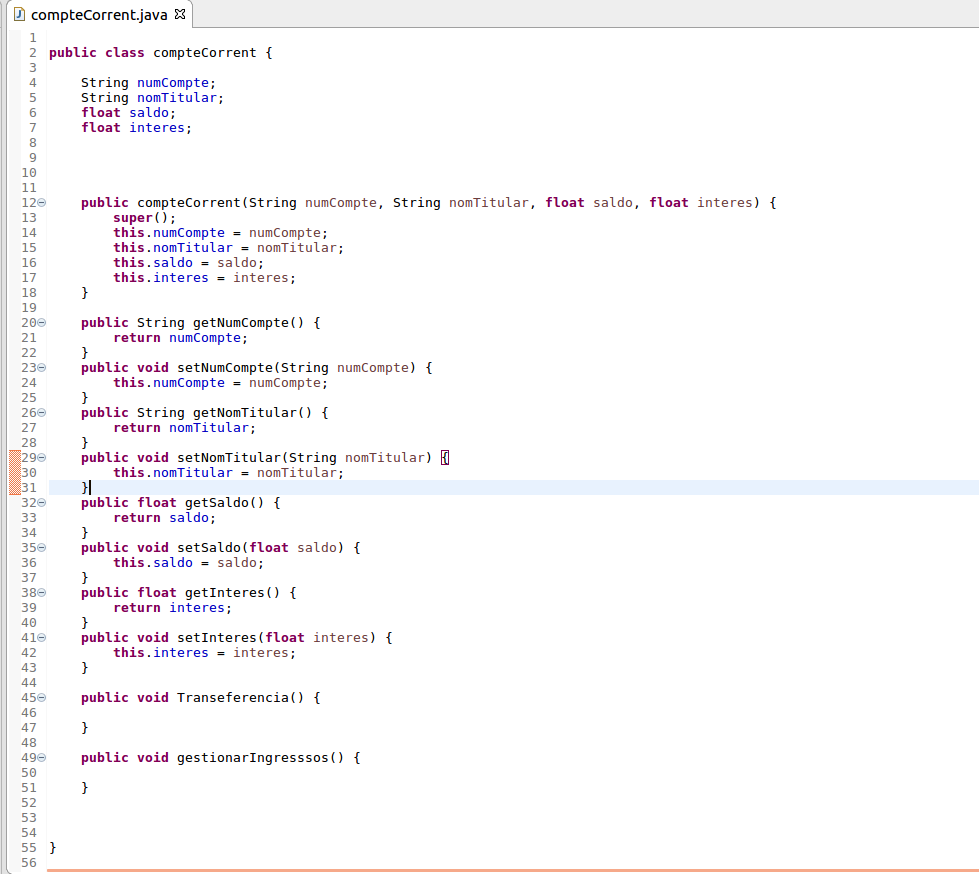

## Tipus d’objecte
L’objectiu d’aquesta activitat és conèixer la sintaxi i les clàusules per a la creació de tipus de
dades.
La informació que s’ha d’emmagatzemar és la següent:

BASKET_PLAYER ( nom, alçada, pes, posicio, equip);
1. Creeu un tipus de dades compost per emmagatzemar les dades d’un jugador.
    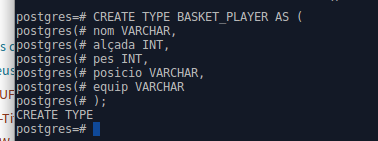
2. Creeu una taula TEAM que emmagatzemi objectes de tipus jugador.

    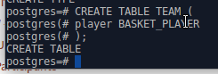
3. Mostreu diferents insercions a la taula i mostrar com utilitzeu el tipus i la taula.

    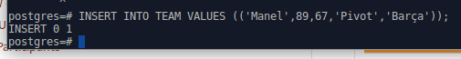
    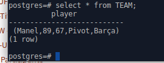

## Taula d’objectes
L’objectiu d’aquesta activitat és conèixer la sintaxi i les clàusules per crear tipus de dades, i
incorporar aquests tipus a la creació de taules.
La informació que s’ha d’emmagatzemar és la següent:

CLIENT(cli_num, cli_nom, carrer, ciutat, cod_pos, tel);

COMANDA (ord_num, cli_num, carr_ent, ciu_ent, codp_ent);

Feu les tasques següents:

1. Creeu un tipus de dades compost per emmagatzemar les dades de l’adreça d’una comanda.

    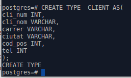

2. Creeu un tipus de dades compost per emmagatzemar les dades d’un client.

    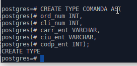

3. Creeu una taula clients que emmagatzemi objectes de tipus client i indiqueu que el camp
número de client serà l’identificador (clau primària).

    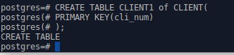

4. Creeu una taula comandes. Utilitzeu el tipus adreça creat anteriorment i indiqueu que el
camp número d’ordre serà l’identificador. Com es modificarà el codi si utilitzem OID?

    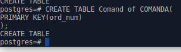
    - Apareixaran dos camps nous

5. Mostreu diferents insercions a les diferents taules i mostrar com utilitzeu el diferents tipus i
taules.

    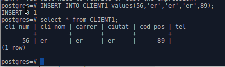
    
    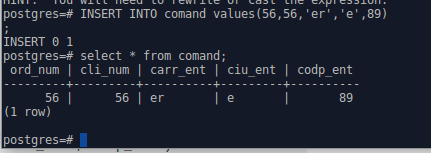